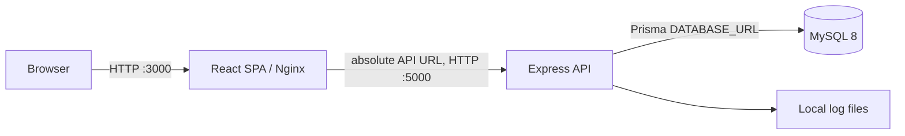
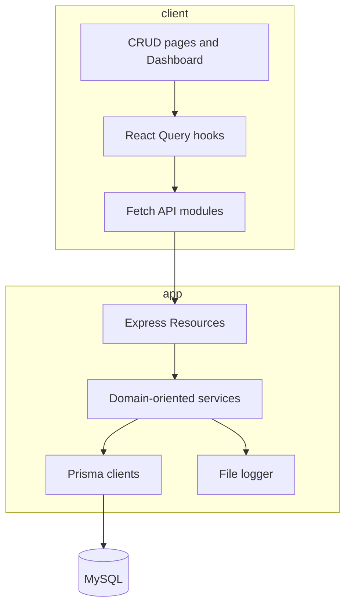
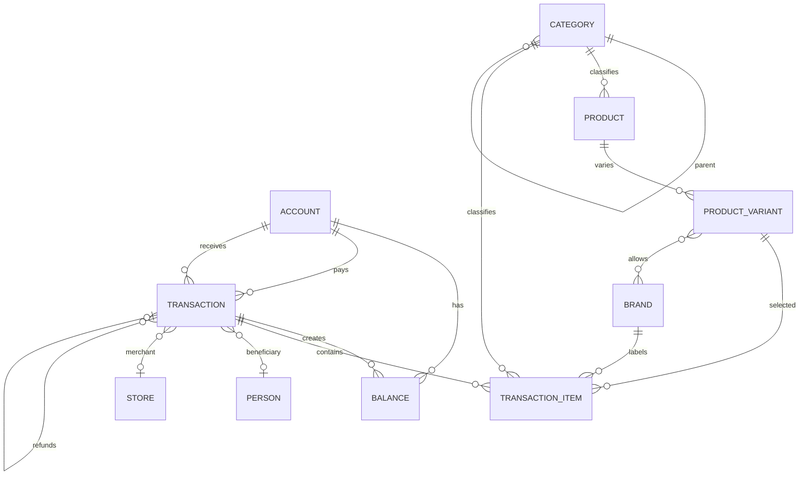
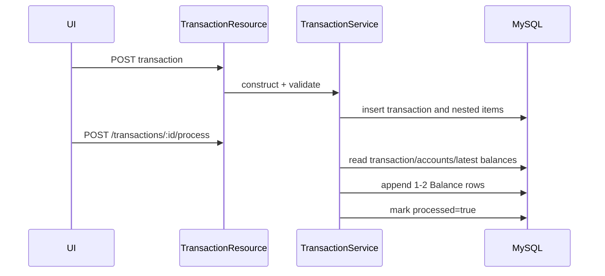
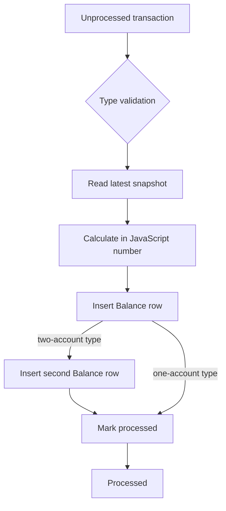
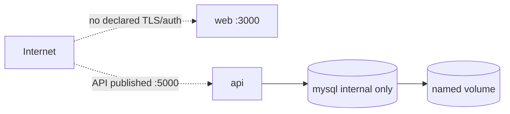

# Persofi AS-IS Analysis

**Baseline:** repository inspection on 2026-07-20. **Evidence notation:** **Verified** means directly observed in tracked source/configuration; **Inference** is a conclusion from verified evidence; **Unknown** means the repository cannot establish it.

## 1. Executive summary

Persofi is a small, coherent TypeScript application: a React single-page client calls an Express REST API backed by Prisma and MySQL. CRUD exists for accounts, people, categories, products, product variants, brands, stores, transactions, balances, and JSON backup/restore. Six transaction types are modeled and transaction processing appends balance snapshots.

It is suitable for local experimentation, not remote production. There is no authentication, authorization, household boundary, request schema validation, CI, committed database migration history, secure production database configuration, operational health endpoint, or recovery-tested backup process. Financial processing is not atomic or concurrency-safe. The unauthenticated destructive restore endpoint and empty production database password are critical release blockers.

## 2. Current architecture and stack

| Concern | Verified implementation |
|---|---|
| Frontend | React 19, Create React App 5, TypeScript 4.9, MUI 7, TanStack Query 5, React Router 7, ApexCharts |
| Backend | Node 20 container, Express 5, TypeScript 5.9 |
| Persistence | Prisma 6, MySQL 8, decimal columns for money |
| Tests | Jest/ts-jest/Supertest; 5 backend suites; no client test files found |
| Packaging | npm lockfiles in both modules |
| Runtime | Docker Compose with `mysql`, `api`, and `web`; Nginx serves the production SPA |
| Logging | Synchronous console and local-file logger |

## 3. Repository and module structure

- `app/`: API resources, services, JSON wrapper/DTO classes, Prisma schema/seed, tests, Dockerfiles.
- `client/`: SPA pages/components, query hooks, API clients, shared models, Nginx config, Dockerfiles.
- `docker-compose.yml`, `docker-compose.dev.yml`: production-like and development orchestration.
- `EXECUTION_PLAN.md`, `FutureEnhancement`, `Errors`: informal planning notes; root `README.md` contains only a name and one-line description.
- **Verified absent:** `.github/`, OpenAPI documentation, infrastructure-as-code, receipt modules, monitoring configuration, deployment scripts, `.env.example`.

## 4. Current domain and database model

All entities use integer IDs and lack user/household ownership. Account type, transaction type, currency, units, and statuses are stored as unrestricted strings at database level. Monetary fields use `Decimal(10,2)` in MySQL but are converted to JavaScript `number` in wrapper classes. `Balance` is an append-only-looking snapshot table, but the schema does not enforce uniqueness per transaction/account or deterministic ordering for same timestamps.

The brand model is real and used by product-variant associations and transaction items. It should be retained for compatibility until usage/data analysis proves it can be retired; it is not required for the target receipt matcher.

## 5. Transaction lifecycle and balance behavior

| Type | Verified balance effect | Main concerns |
|---|---|---|
| Expense | Debit/cash/saving decreases; credit debt snapshot increases | No account-type allowlist beyond credit branch; no atomic processing |
| Income | Receiving non-credit account increases | Error text omits future types; no currency validation |
| Credit payment | Source decreases; credit debt decreases | Accounts may be identical; two writes can partially succeed |
| Transfer | Source decreases; destination increases | Same-account and cross-currency transfers are not rejected |
| Refund | Receiving non-credit increases; credit debt decreases | Processor uses `grandTotal`, dashboard uses `amount` (normally zero); refund eligibility/aggregate cap not validated |
| Initial balance | Creates first snapshot at supplied amount | Control flow depends on matching an exception message; positive-only prevents negative credit opening debt conventions from being explicit |

Creation uses Prisma nested writes and is atomic for transaction plus items. Update deletes items, updates the transaction, then recreates items in three independent operations. Processing similarly performs independent writes. There is no idempotency key, optimistic concurrency token, row locking, reversal workflow, or supported update/delete of processed financial effects.

## 6. Beneficiaries, products, variations, and stores

- **Beneficiary:** `Transaction.personId` is an optional transaction-level person. Items have no beneficiary. Dashboard assigns the whole expense total to that person.
- **Products:** generic product belongs to one category. Items reference a variant rather than a product directly; product is inferred through variant. Items can also carry a category independent of the product category, permitting inconsistency.
- **Variations:** `ProductVariant` is defined by product, unit size/type, and optional description. The unique key omits description, so two meaningful variations with equal size/type cannot coexist.
- **Brands:** fully modeled and exposed through CRUD; evidence does not establish whether real data depends on it.
- **Stores:** unique merchant names, URL, active flag; no location model and no alias normalization.

## 7. Dashboard calculations

All dashboard metrics are calculated client-side after fetching complete transaction and balance collections. Net worth treats credit snapshots as liabilities. Expense and income use transaction totals; category reports sum item line totals; person reports assign entire transaction totals. Transfers and credit payments are incorrectly subtracted in `netCashFlow`; refunds are read from `amount` although refund validation requires amount zero and stores value in `grandTotal`. Metrics do not consistently filter `processed`, disclose itemization coverage, reconcile items, handle incomplete itemization, or define multi-currency aggregation. Product/variation consumption metrics are absent.

## 8. Frontend, backend, and API

The frontend offers pages for dashboard, accounts, persons, categories, stores, brands, products/variants, transactions, and settings. Transaction forms cover expense, income, transfer, credit payment, refund dialog, and processing. API calls use an absolute build-time base URL and contain no credentials/session handling. There is no receipt upload/review UI.

Express mounts unversioned routes under `/api`. Resource modules directly construct services; each service constructs a Prisma client through `BaseService`, potentially creating many pools. Payload conversion is ad hoc (`Number`, `Boolean`, `new Date`) and can turn missing/invalid values into `NaN`, invalid dates, or surprising booleans. Error responses can expose raw database/internal error messages. No pagination exists.

## 9. Authentication and authorization

**Verified absent.** There are no users, households, passwords, sessions, tokens, auth middleware, ownership columns, or object-level authorization. CORS uses permissive defaults. Every CRUD route, all financial data, and full backup/restore are remotely callable by any network client that can reach port 5000.

## 10. Tests and observed validation

- Backend build: passed (`npm run build`). Frontend production build: passed with many ESLint warnings.
- Unit suites: 43 validator tests passed in the attempted run.
- Integration suites: 45 tests failed because MySQL at `localhost:3306` was unavailable; Supertest binding also encountered sandbox `EPERM`. The repository does not provide a self-contained CI test service.
- Coverage thresholds/reports, client component tests, E2E, migration tests, concurrency tests, authorization tests, security tests, backup-restore verification, and deployment smoke tests are absent.

## 11. Docker, CI/CD, and deployment

Dockerfiles use multi-stage builds for production, but runtime containers run as root, images use floating tags, and no API/web health checks or graceful init are defined. MySQL allows an empty root password; the API connects as root. Database port is not published, which is positive. `prisma migrate deploy` runs on startup, but `app/prisma/migrations/` is gitignored and contains only an untracked lock file locally, so a clean deployment has no schema migration to apply. Production startup also seeds automatically.

Compose syntax validates. A clean image build/start and persistence/restore cycle were not executed in this analysis. There is no CI/CD, registry publication, deployment target, TLS proxy, secret manager, rollback automation, resource limits, or remote-access configuration.

## 12. Security controls and risks

Existing positives are parameterized Prisma queries, lockfiles, internal-only MySQL networking, ignored local environment files, and TypeScript strict mode. Critical/high risks are:

1. Unauthenticated access to all personal financial data and mutations.
2. Unauthenticated destructive `/api/backup/restore` with non-transactional delete/reinsert.
3. Empty MySQL root password and root application connection.
4. Non-atomic financial processing and race-prone processed flag.
5. Missing household/object authorization model.
6. Permissive CORS, missing secure headers/rate limiting/body limits, and no validated input schemas.
7. Logger serializes request/domain objects and internal errors to files, risking sensitive-data leakage.
8. No dependency, code, secret, container, or IaC scanners.
9. No receipt code exists; future file parsing therefore has no controls yet.

## 13. Logging, monitoring, backup, and recovery

Logging is synchronous, unstructured text written to console and relative `logs/*.log`; no rotation, redaction, correlation ID, or centralized collection exists. No metrics, alerting, readiness/liveness distinction, or monitoring exists.

Backup export returns all rows as JSON over an unauthenticated endpoint. Restore destructively replaces data without a database transaction, schema compatibility checks beyond version `1`, integrity verification, encryption, or restore test. There are no scheduled dumps, retention policy, off-host copies, or point-in-time recovery.

## 14. Technical debt, functional gaps, and blockers

- No committed initial migration; schema drift/data preservation cannot be controlled.
- No financial ledger/reversal semantics, atomic processor, concurrency control, or auditable actor/timestamps.
- Refund dashboard/processor contract mismatch; transfer/credit payment contamination of cash flow.
- No item beneficiary/default distinction, itemization status, unallocated amount, raw receipt label, discounts/fees/tips, aliases, or receipt drafts.
- No direct item product reference; category duplication can conflict with product category.
- No account ownership, household tenancy, auth, or authorization.
- No deployment, TLS, operational scripts, security pipeline, client test suite, or API contract documentation.
- Root README and environment documentation are insufficient.

## 15. Unknowns and assumptions

- **Unknown:** production/real data volume, MySQL version in actual use, existing schema created outside migrations, and whether backups have ever been restored.
- **Unknown:** intended number of users/households, preferred identity/email provider, domain ownership, hardware available for OCR, receipt languages/layouts, and monthly budget.
- **Unknown:** whether brand data is materially used; preserve it until measured.
- **Assumption for planning:** preserve MySQL, Express, React, Prisma, existing IDs and transaction records; evolve as a modular monolith.
- **Assumption for safe first deployment:** private access (Tailscale) plus application authentication is preferable until household authorization and security testing are complete.
