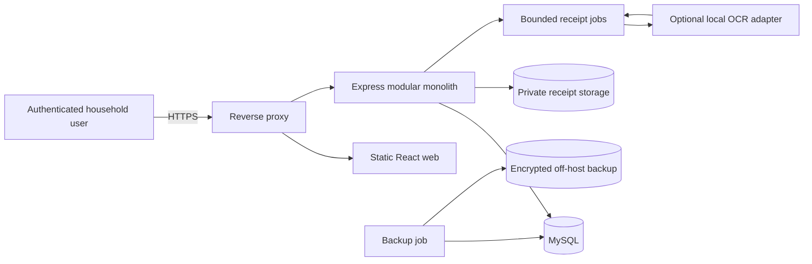
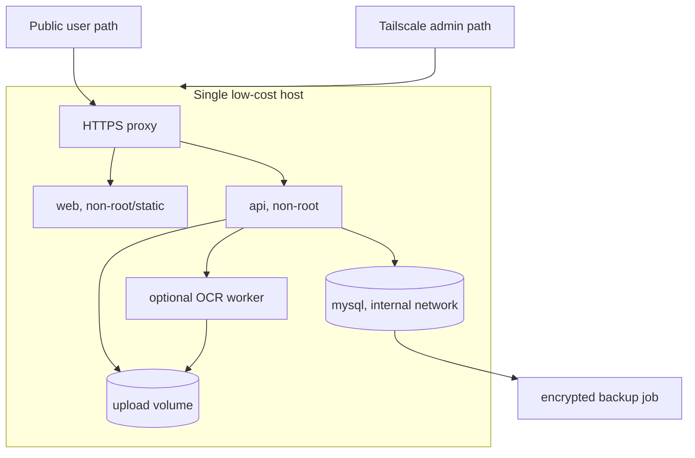
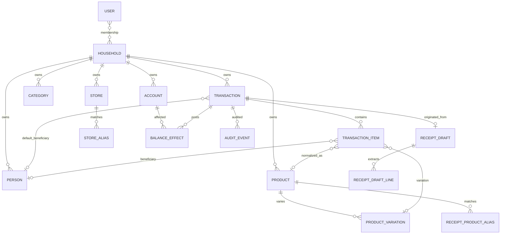
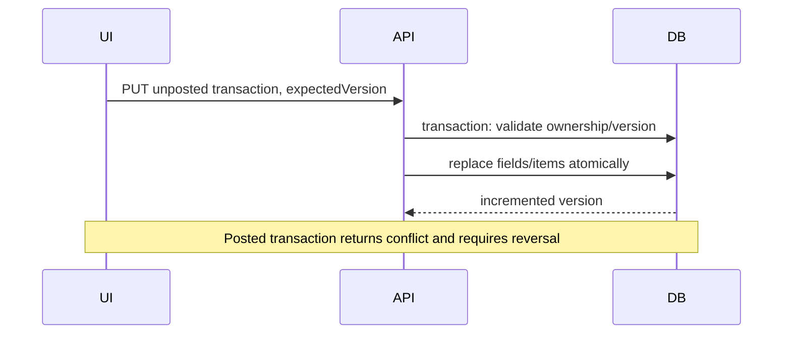
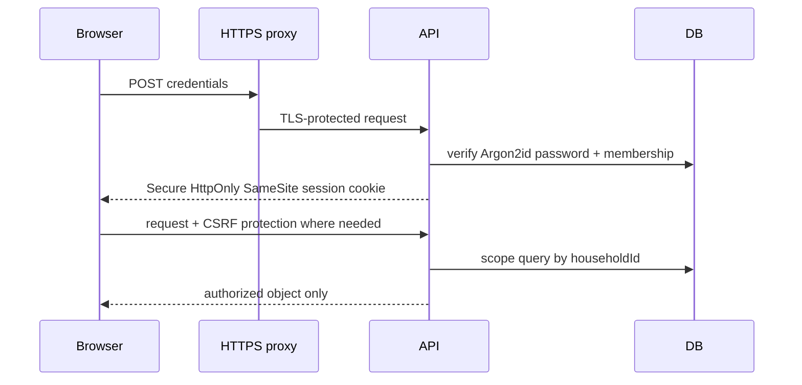

# Persofi TO-BE Architecture

## 1. Architectural decision

Evolve the existing React + Express + Prisma + MySQL system as a **modular monolith**. Keep one deployable API and one database. Introduce a receipt-processing adapter inside the backend first; isolate a Python OCR worker only if a benchmark proves the Node/local command adapter inadequate. Do not add n8n, Kubernetes, or Ollama to the production critical path.



## 2. Target containers and deployment



Production exposes only 443 (and optionally 80 for redirect). MySQL remains internal. Images are immutable and versioned; migrations run as an explicit deployment step, never concurrently in every API replica. Health probes cover process liveness, database readiness, and migration compatibility. Development compose retains hot reload; production compose has no source mounts and uses secrets/environment injection.

## 3. Target domain model



All household data receives `householdId`; every lookup and mutation scopes by it. Add created/updated timestamps and an optimistic version where mutable concurrency matters. Existing `personId` is renamed semantically to `defaultBeneficiaryId` through a backward-compatible staged migration. Add nullable `beneficiaryId` to items. Effective beneficiary is resolved deterministically as `item.beneficiaryId ?? transaction.defaultBeneficiaryId`; persisted reports use that rule and never AI inference.

Transaction stores financial total independently of itemization. Introduce enums/check constraints (or service validation where Prisma/MySQL constraints are limited) for transaction type, financial status, and itemization status: `NOT_ITEMIZED`, `PENDING_EXTRACTION`, `PARTIALLY_ITEMIZED`, `NEEDS_REVIEW`, `FULLY_ITEMIZED`, `EXTRACTION_FAILED`. `unallocatedAmount` is derived as financial total minus allocated item/tax/fee/discount components, not trusted from clients.

Transaction items preserve `rawDescription` and optional `normalizedDescription`; reference generic `productId` directly and optional `productVariationId`. Add discount and extraction/review metadata. Retain existing brand fields as optional legacy-compatible metadata, but do not make brands part of matching requirements.

## 4. Deterministic financial posting

Define one balance-impact policy returning immutable signed effects:

| Type | Effects |
|---|---|
| Income | `destination +amount` |
| Expense, asset account | `source -total` |
| Expense, credit account | `source debt +total` |
| Transfer | `source -amount`, `destination +amount` |
| Credit payment | `source -amount`, `credit debt -amount` |
| Refund to asset | `destination +refundTotal` |
| Refund to credit | `destination debt -refundTotal` |
| Initial balance | `destination set/opening amount` exactly once |

```mermaid
sequenceDiagram
  participant C as Client
  participant A as API
  participant P as Posting policy
  participant D as MySQL transaction
  C->>A: Confirm/process transaction + idempotency key
  A->>D: begin; lock transaction/accounts
  A->>P: validate type/accounts/currency/amount
  P-->>A: deterministic signed effects
  A->>D: insert effects/snapshots + audit event
  A->>D: mark posted with version/key
  D-->>A: commit atomically
  A-->>C: posted representation
```

Money stays Decimal/string at API boundaries; no binary floating-point equality for financial rules. Enforce source/destination difference, compatible currency or explicit exchange data, refund linkage and remaining eligible amount, unique posting per transaction/account, idempotency keys, and row locks/optimistic versions. Posted transactions are corrected by reversal/replacement, not mutation or deletion.



## 5. Optional itemization and dashboards

Financial validity depends on transaction type/accounts/total, not item rows. Reconciliation computes allocated items, taxes, fees, tips, discounts, and unallocated amount with a configurable currency-aware tolerance. Itemized reports disclose numerator, denominator, coverage percentage, and unallocated amount. Refund allocation is explicit and consistently applied.

Financial metrics are server-calculated from posted transactions/effects with documented formulas; transfers and credit payments are excluded from income/expense/net cash flow. Refunds reduce expense for the reporting period and retain original-link reporting. Consumption metrics use item lines and effective beneficiaries only, disclose coverage, and never imply completeness for partial data. Multi-currency totals remain separated unless an explicit exchange-rate source and date are provided.

## 6. Receipt-processing architecture

Start with an in-backend orchestration module and an adapter interface. A bounded local worker may use Tesseract/PaddleOCR/docTR after a representative benchmark. Ollama/vision is optional enrichment, not required for first release. n8n adds no necessary value at current scale.

```mermaid
sequenceDiagram
  participant U as User
  participant A as API
  participant S as Quarantine storage
  participant O as OCR adapter
  participant M as Match/reconcile
  U->>A: Upload image/PDF
  A->>A: authorize + signature/size/dimension/page validation
  A->>S: random-name quarantine write + SHA-256
  A->>A: duplicate candidate check
  A->>O: bounded extraction job
  O-->>A: strict-schema untrusted result
  A->>M: store/product aliases + confidence + reconciliation
  M-->>U: editable draft; no financial write
  U->>A: confirm reviewed draft
  A->>A: deterministic transaction validation
  A->>DB: create unposted transaction atomically
```

Drafts preserve raw extraction JSON and raw labels. `StoreAlias` and `ReceiptProductAlias` are household-scoped; previously confirmed store-specific aliases rank above global aliases. Unknown lines remain unresolved and never auto-create products. Duplicate scoring combines hash and receipt metadata; a single weak field never blocks import. The OCR process has no database credentials, outbound network, arbitrary tool access, or financial-write capability.

## 7. API and frontend changes

Version APIs (`/api/v1`), publish OpenAPI, validate requests/responses, paginate lists, use consistent errors and correlation IDs, and require authentication. Add backward-compatible beneficiary/itemization fields before deprecating `personId`. Add draft upload/status/review/confirm endpoints with idempotency and strict authorization. Use same-origin `/api` behind the proxy to avoid build-time host coupling.

Frontend adds sign-in/session handling, household context, route guards, default and per-item beneficiary controls, optional itemization, reconciliation/coverage indicators, receipt upload/review, and server-backed dashboards. Accessible errors must surface validation without exposing internals.

## 8. Authentication and authorization



Use server-side sessions or rotated opaque tokens in Secure, HttpOnly, SameSite cookies; hash passwords with Argon2id; throttle login; support credential revocation and password reset. Add CSRF protection for cookie-authenticated mutations, restrictive CORS/same-origin deployment, secure headers, and object-level authorization. For the first private deployment, add Tailscale as defense in depth, not a replacement for application auth.

## 9. Security, privacy, and failure handling

- Validate all API payloads and uploads; limit JSON size, file size, image dimensions, PDF pages, job duration, concurrency, and output size.
- Store receipts privately outside executable/static paths; randomize names; optionally malware-scan; encrypt backups and protect storage credentials.
- Redact financial payloads, tokens, filenames, and parser output from logs. Emit structured audit events for auth, posting, reversals, restores, and receipt confirmation.
- Pin dependencies/images/actions; CI runs dependency audit, CodeQL, Gitleaks, Trivy, Hadolint, and Compose/config validation without redundant scanners.
- OCR failures move drafts to retryable/failed states; they cannot affect balances. Financial transactions roll back as one DB unit. Idempotency makes safe retries possible.

## 10. CI/CD, observability, backup, and recovery

CI separately builds/types/lints/tests both modules, provisions MySQL for integration/migration tests, builds images, validates Compose, and runs scanners with least-privilege permissions. Deployment remains manual/approved initially: backup, migrate, deploy immutable tag, health-check, smoke-test, then mark release. Rollback restores the previous image; database rollback uses forward-compatible migrations or a pre-migration backup rather than destructive down migrations.


Expose `/health/live`, `/health/ready`, and build/version metadata without secrets. Use structured stdout logs, request IDs, rotation at container runtime, uptime checks, disk/database alerts, and backup success/failure alerts. Never log receipt contents by default.

## 11. Performance and compatibility

Add pagination and database indexes for household/date/status/foreign-key report paths. Move aggregate reporting server-side. Reuse one Prisma client per process. Bound OCR separately so it cannot starve API resources.

Migrate additively: create ownership/default/item columns nullable, backfill and verify, deploy dual-read/write compatibility, then enforce constraints. Preserve IDs, transaction types, brand data, existing item descriptions, and balances. Before the first schema change, take and test a backup against a clone. Mixed-version deployment is limited to the documented dual-write window.

## 12. Rollback strategy

1. Every release uses an immutable image tag and records previous tag/schema version.
2. Pre-deploy checks validate secrets, backup recency, disk, migration plan, and health.
3. Additive migrations precede compatible code; constraint tightening follows verified backfills.
4. Application rollback switches to the previous image when schema remains backward compatible.
5. A failed destructive/constraint migration stops deployment; restore is performed only from a verified pre-migration backup into a controlled outage.
6. Receipt/OCR features have a kill switch; disabling them never affects financial posting.
